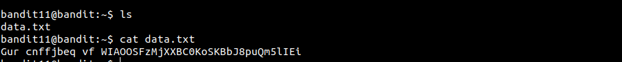
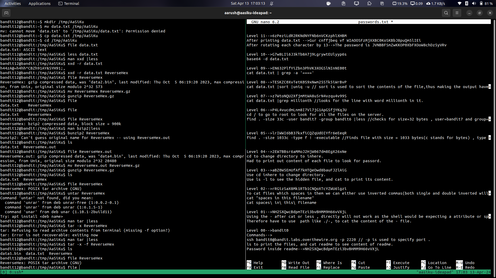
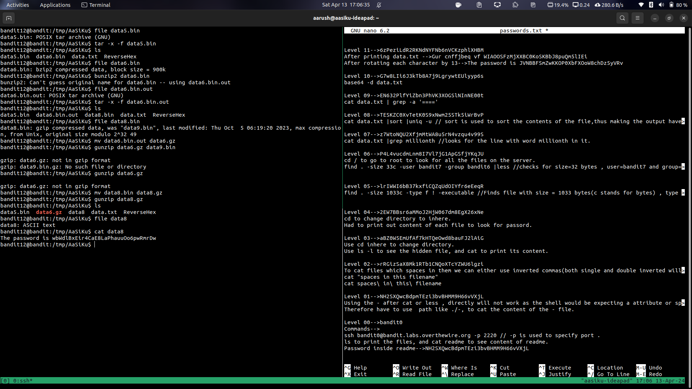
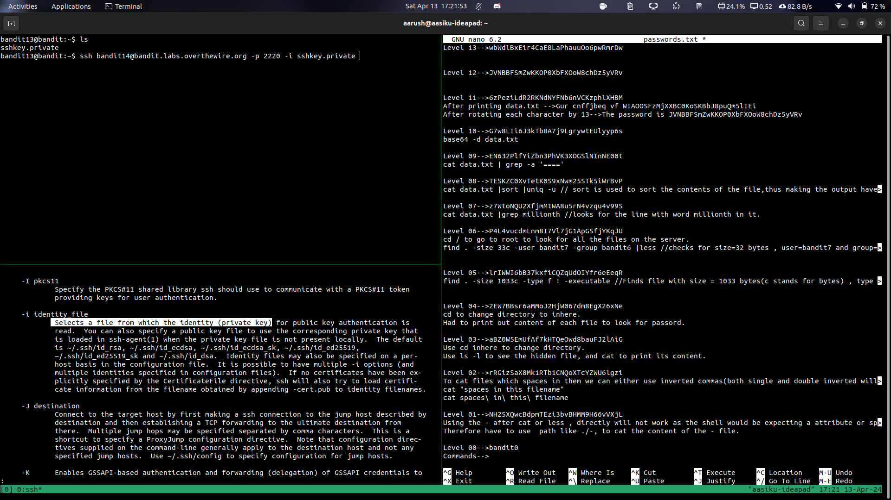
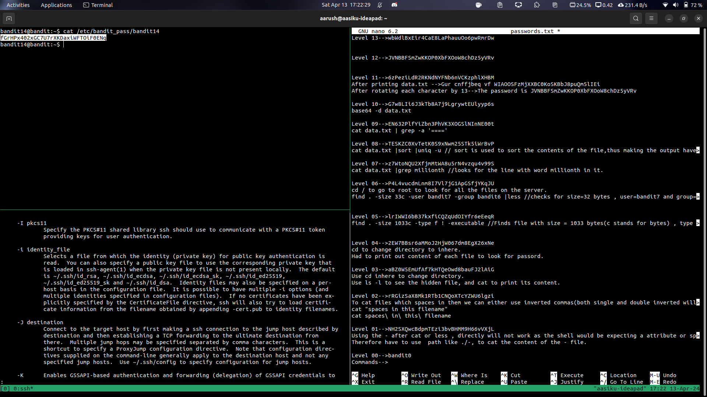
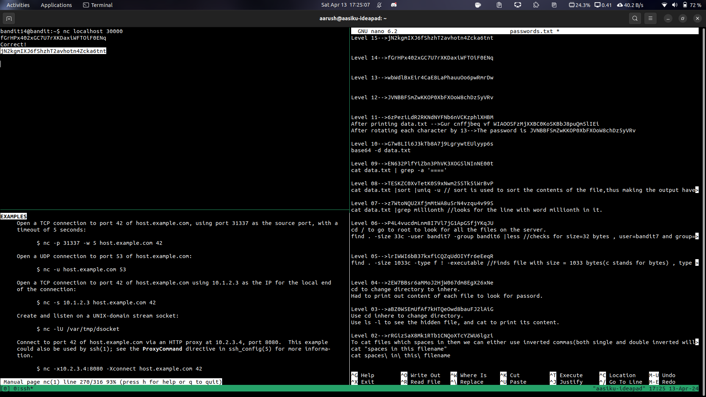
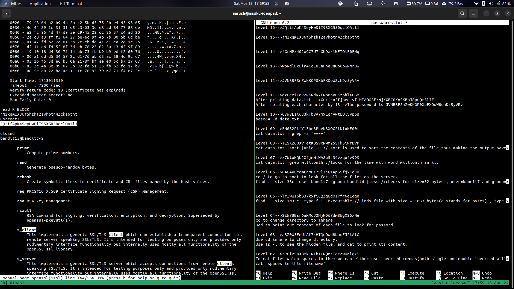

## Solution of First 15 Levels

### Level 00:-
>Password: bandit0  

__Commands-->__
```bash
ssh bandit0@bandit.labs.overthewire.org -p 2220 # -p is used to specify port .
```
`ls` to print the files, and cat readme to see content of readme.  
Password inside readme-->NH2SXQwcBdpmTEzi3bvBHMM9H66vVXjL


### Level 01:-
>Password: NH2SXQwcBdpmTEzi3bvBHMM9H66vVXjL  

Using the - after cat or less , directly will not work as the shell would be expecting a attribute or specifier (like -l -a, etc) .
Therefore have to use  path like ./-, to cat the content of the - file.

### Level 02:-
>Password: rRGizSaX8Mk1RTb1CNQoXTcYZWU6lgzi

To cat files with spaces in them we can either use inverted commas(both single and double inverted will work) or use backslash before the space.
```bash
cat "spaces in this filename"
cat spaces\ in\ this\ filename
```

### Level 04:-

>Password: 2EW7BBsr6aMMoJ2HjW067dm8EgX26xNe

Used `cd inhere` to change directory.  
Used `ls -l` to see the hidden file, and cat to print its content.


### Level 05:-
>Password: lrIWWI6bB37kxfiCQZqUdOIYfr6eEeqR

```bash
find . -size 1033c -type f ! -executable #Finds file with size = 1033 bytes(c stands for bytes) , type is file, ! is not and -executable checks for if file is executable or not.
```

### Level 06:-
>Password: P4L4vucdmLnm8I7Vl7jG1ApGSfjYKqJU

+ `cd / `to go to root to look for all the files on the server.
+ `find . -size 33c -user bandit7 -group bandit6 |less` #checks for size=32 bytes , user=bandit7 and group=bandit6

### Level 07:-
>Password: z7WtoNQU2XfjmMtWA8u5rN4vzqu4v99S
```bash
cat data.txt |grep millionth #looks for the line with word millionth in it.
```

### Level 08:-
>Password: TESKZC0XvTetK0S9xNwm25STk5iWrBvP
```bash
cat data.txt |sort |uniq -u # sort is used to sort the contents of the file,thus making the output have the duplicate elements next to each other, uniq -u prints only non-duplicate values.
```

### Level 09:-
>Password: EN632PlfYiZbn3PhVK3XOGSlNInNE00t

```bash
cat data.txt | grep -a '====' #Passing the output of cat to grep, which searches for equal to in data.txt(added = till I could see the flag)
```

### Level 10:-
>Password: G7w8LIi6J3kTb8A7j9LgrywtEUlyyp6s
```bash
base64 -d data.txt # Base64 -d is used to decrypt base64 data and takes a file as input.
```

### Level 11:-
>Password: 6zPeziLdR2RKNdNYFNb6nVCKzphlXHBM

+ After printing data.txt -->Gur cnffjbeq vf WIAOOSFzMjXXBC0KoSKBbJ8puQm5lIEi
+ After rotating each character by 13-->The password is VNBBFSmZwKKOP0XbFXOoW8chDz5yVRv

#### PROCESS-->


### Level 12:- 
>Password: JVNBBFSmZwKKOP0XbFXOoW8chDz5yVRv
#### PROCESS-->
+ First copied the file to a new folder inside temp
+ `cat data.txt` to see the content
+ Used `xxd -r data.txt ReverseHex` to create a reverse hex dump , found the revert command in the man page of xxd.
+ Used `file ReverseHex` to see the file type found it to be gzip, used `gunzip ReverseHex.gz` to unzip the file
+ Repeated the process of checking file type and then extracting it accordingly till I got the type as ASCII.





### Level 13:- 
>Password: wbWdlBxEir4CaE8LaPhauuOo6pwRmrDw

```bash
 ssh bandit14@bandit.labs.overthewire.org -p 2220 -i sshkey.private # -i is used to specify the private key file to use.
```


```bash
cat /etc/bandit_pass/bandit14 # Address provided in question, this was the file that contained password
```




### Level 14:- 
>Password: fGrHPx402xGC7U7rXKDaxiWFTOiF0ENq

#### PROCESS-->
+ Used `nc localhost 30000` to connect to port 30000 of localhost
+ Typed the password of level 14 to get password of level 15.



### Level 15:- 
>Password: jN2kgmIXJ6fShzhT2avhotn4Zcka6tnt

#### PROCESS-->

+ Used `openssl s_client localhost:30001 ` to connect to localhost port 30001 as a client using ssl encryption
+ Typed the password of level 15 to get password of level 16
.



